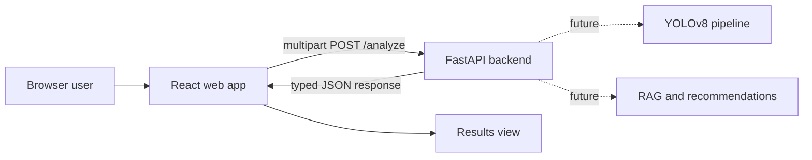

# Glowli

Glowli is a web-first skincare analysis project. A user selects a selfie in the browser, the React frontend uploads it to a FastAPI endpoint, and the API returns a typed skin-analysis response. The current `/analyze` response is a development mock while the computer-vision pipeline is being built.

## Active Tech Stack

- **Frontend:** React + TypeScript + Vite + CSS
- **HTTP client:** Axios
- **Backend:** Python + FastAPI + Pydantic
- **Planned ML:** YOLOv8 + PyTorch
- **Planned personalization:** LangChain + ChromaDB + an evaluated language model

## Project Structure

- `web/` - active React and TypeScript browser application
- `backend/` - FastAPI REST API and mock analysis response
- `ml/` - YOLOv8 experiments and future training code
- `mobile/` - preserved legacy Expo prototype; no longer the active product direction
- `.github/workflows/` - future CI/CD workflows

## Current Workflow



## Implemented Features

- Browser-based selfie file selection
- Local image preview
- Loading and error states
- Axios multipart upload to FastAPI
- Typed analysis response shared across the web UI
- Results view for skin type, conditions, severity, and confidence
- FastAPI health endpoint
- Mock FastAPI analysis endpoint
- Generic YOLOv8 proof-of-concept script

## Local Setup

### 1. Start FastAPI

```powershell
Set-Location C:\glowli\backend
.\.venv\Scripts\python.exe -m uvicorn app.main:app --reload --host 127.0.0.1 --port 8000
```

Verify the API at `http://127.0.0.1:8000/health`.

### 2. Configure the web frontend

Copy `web/.env.example` to `web/.env.local` when you need to override the default API URL.

```dotenv
VITE_API_BASE_URL=http://127.0.0.1:8000
```

### 3. Start React

```powershell
Set-Location C:\glowli\web
npm install
npm run dev
```

Open `http://localhost:5173`.

## MVP Roadmap

### Phase 1 - Web Foundation

- [x] Repository setup
- [x] React web app scaffold
- [x] Backend API scaffold
- [x] Browser selfie upload
- [x] Mock results workflow
- [ ] Automated frontend and backend tests

### Phase 2 - Core AI

- [ ] Image validation and preprocessing
- [ ] Face detection pipeline
- [ ] Fine-tuned skin condition detection
- [ ] Severity scoring
- [ ] Model evaluation and documented metrics

### Phase 3 - Personalization

- [ ] Product recommendation engine
- [ ] RAG-based skincare knowledge base
- [ ] Personalized skincare routines

### Phase 4 - User Experience

- [ ] Authentication
- [ ] User profiles
- [ ] Analysis history
- [ ] Progress tracking dashboard

### Phase 5 - Production

- [ ] Cloud deployment
- [ ] CI/CD pipeline
- [ ] Analytics and error monitoring
- [ ] Beta testing

## Important Scope Note

Glowli currently returns mock development data and must not be presented as a medical diagnosis. Real model claims should only be added after training, evaluation, safety review, and privacy controls are complete.
