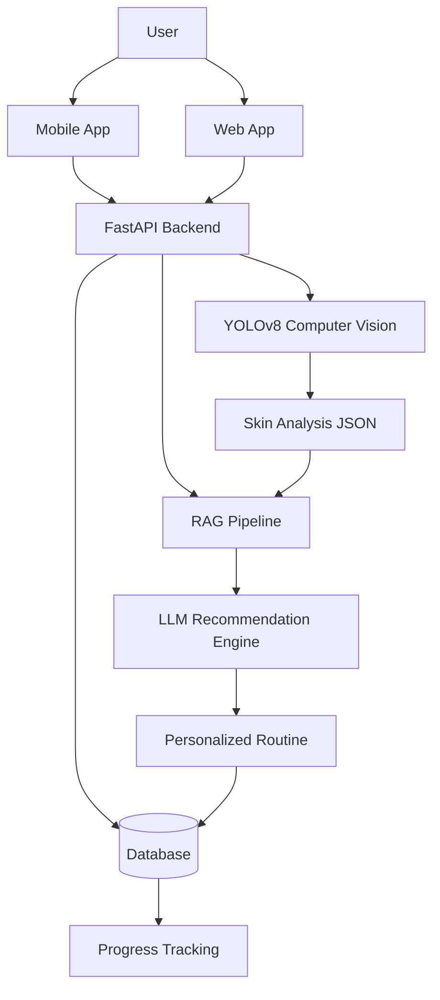

# Glowli
An AI-powered IOS and webb app that analyzes your skin from a selfie, detects conditions like acne
and hyperpigmentation, recomments personalized skincare products, and generates a custom routine 
using a RAG-powered LLM.

## Tech Stack
- **Mobile:** React Native + Expo + Typescript
- **Web:** React + TypeScript + Tailwind CSS
- **Backend:** Python + FastAPI
- **ML:** YOLOv8 + PyTorch + LangChain + ChromaDB + FLAN-T5

## Project Structure
- mobile - Expo React Native IOS app
- web - React web version
- backend - FastAPI REST API + ML inference
- ml YOLOv8 training scripts and RAG ingestion

## System Architecture

## Features

## MVP Roadmap

### Phase 1 – Foundation
- [x] Repository setup
- [x] Mobile app scaffold
- [x] Web app scaffold
- [ ] Backend API scaffold

### Phase 2 – Core AI
- [ ] Selfie upload
- [ ] Face detection pipeline
- [ ] Skin condition detection (YOLOv8)
- [ ] Severity scoring

### Phase 3 – Personalization
- [ ] Product recommendation engine
- [ ] RAG-based skincare knowledge base
- [ ] Personalized skincare routines

### Phase 4 – User Experience
- [ ] Authentication
- [ ] User profiles
- [ ] Save analysis history
- [ ] Progress tracking dashboard
- [ ] Push notifications

### Phase 5 – Production
- [ ] Cloud deployment
- [ ] CI/CD pipeline
- [ ] Analytics
- [ ] Beta testing

## Setup
Coming soon as the project develops

